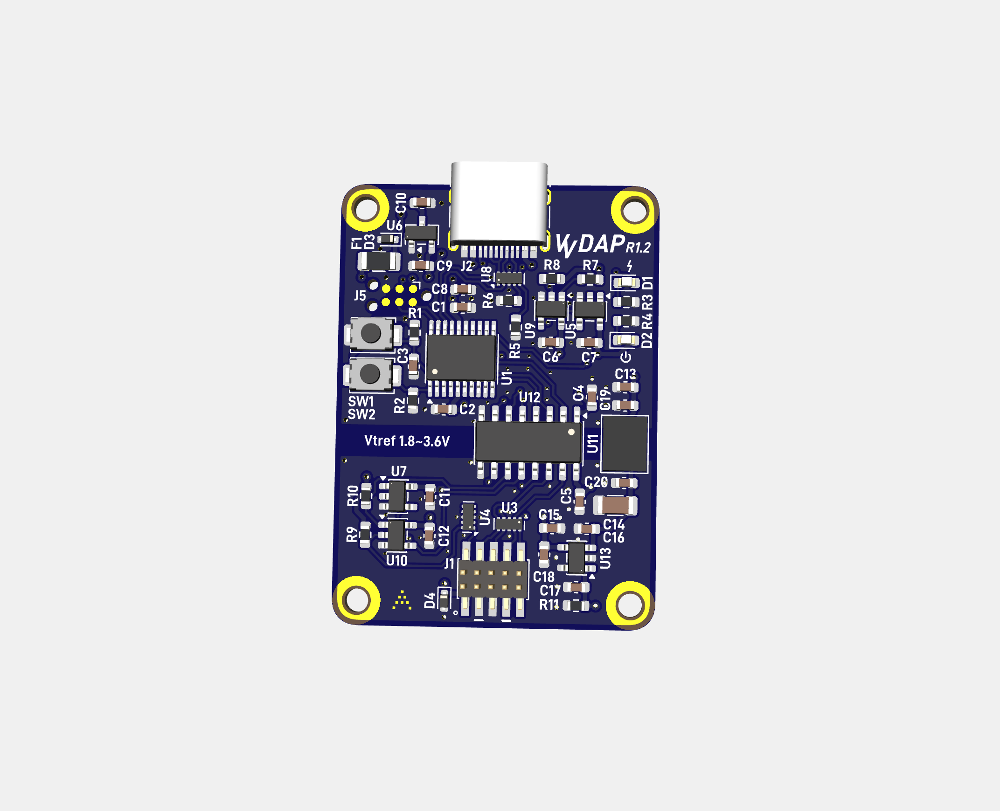
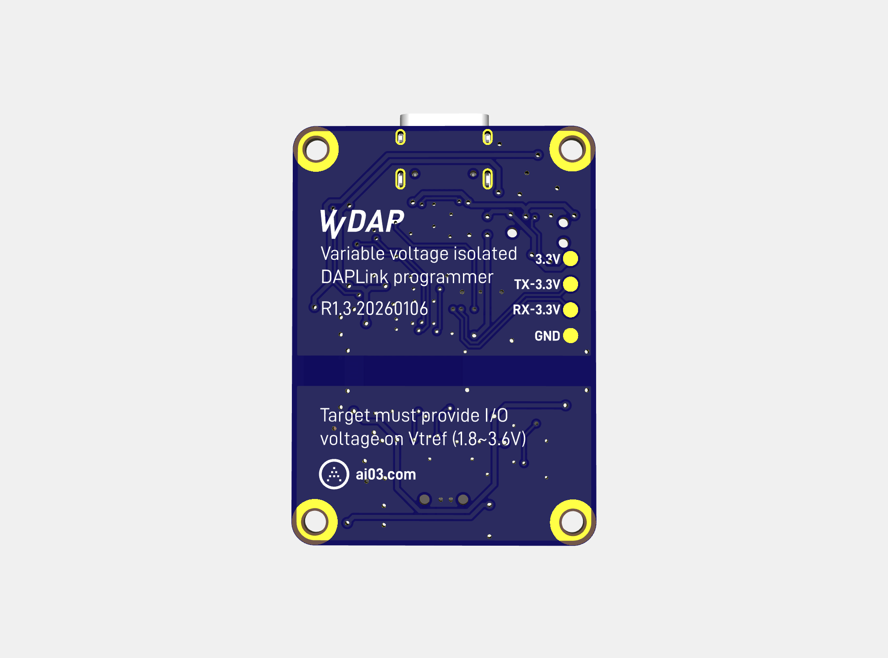

# VVDAP
Variable voltage isolated DAPLink programmer  

**Warning:** Currently untested.  
If testing, proceed at your own risk.  

## Features
- DAPLink capabilities
  - [DAPLink](https://daplink.io) programming device for flashing Arm Cortex devices
  - Standard 10-pin (5x2) 1.27mm pitch Cortex debug connector for connection to target
  - Exposes UART pins - for future variable-voltage UART module addon via spring-loaded headers
- Variable voltage
  - Variable I/O voltage from 1.8 to 3.6V which self-adjusts to match the target VCC voltage provided on Vtref pin of debug header
- Protection
  - Full isolation between host and target to avoid ground loops or damage to host
  - ESD protection on USB lines and debug connector I/O
  - Polyfuse on USB VBUS
- Modern nice-to-haves
  - USB-C 
  - Fairly compact single-board solution
  - Relatively straightforward to solder at home with a reflow plate and (possibly 3D-printed) solder paste stencil
  - Very affordable (likely <15 USD) compared to the multi-hundred dollar commercial programmers

## Credits
This project builds upon the shoulders of giants - credits go to the following for nearly all of the heavy lifting.  
- [XIVN1987's DAPLink port](https://github.com/XIVN1987/DAPLink) to the CH32V203 microcontroller
- [XIVN1987's reference CH32V203/AT32F425 hardware design](https://oshwhub.com/xivn1987/daplink) for the above port
- [盐汽水-BD4USQ's DAPLink isolator design](https://oshwhub.com/yanqisui/dap-jlink-ge-li-diao-shi-kuo-zhan-ka) (and in turn the projects which it credits) which makes push-pull SWDIO possible over unidirectional isolators/transcievers 

## Changes from the above
- Swapped the digital I/O isolator to an ADuM162N capable of reaching low I/O voltage levels
- Added ESD protection on USB and I/O lines using TPD4E05U06 and ESD5Z5V0 TVS diodes
- Isolated voltage supply rail using the MIE1W0505/R05C1TF05S compact isolated DC/DC converter
- Added a TPS7B4250 tracking LDO to replicate the voltage provided on the Vtref pin of the debug header from the isolated supply rail, which in turn powers the secondary side of the I/O isolator and push-pull splitter
- Changed output connector to a 10-pin (2x5) 1.27mm pitch Cortex debug header
- Removed all power output capabilities 
  - Target should self-power to avoid potentially dangerous voltage mismatches, reverse voltage injection into circuitry not designed to withstand it, or voltage injection into batteries
- Misc component swaps

## Todo
- Produce and test
- Make a 3D printed case
- Make a variable voltage UART module which stacks onto the main board